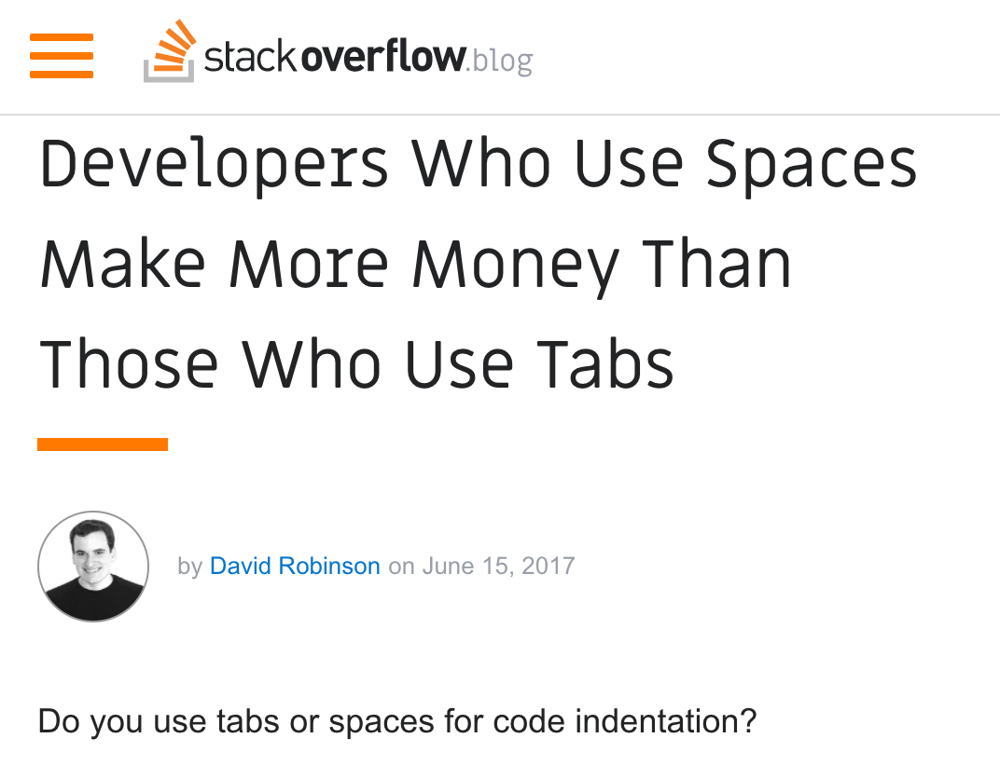
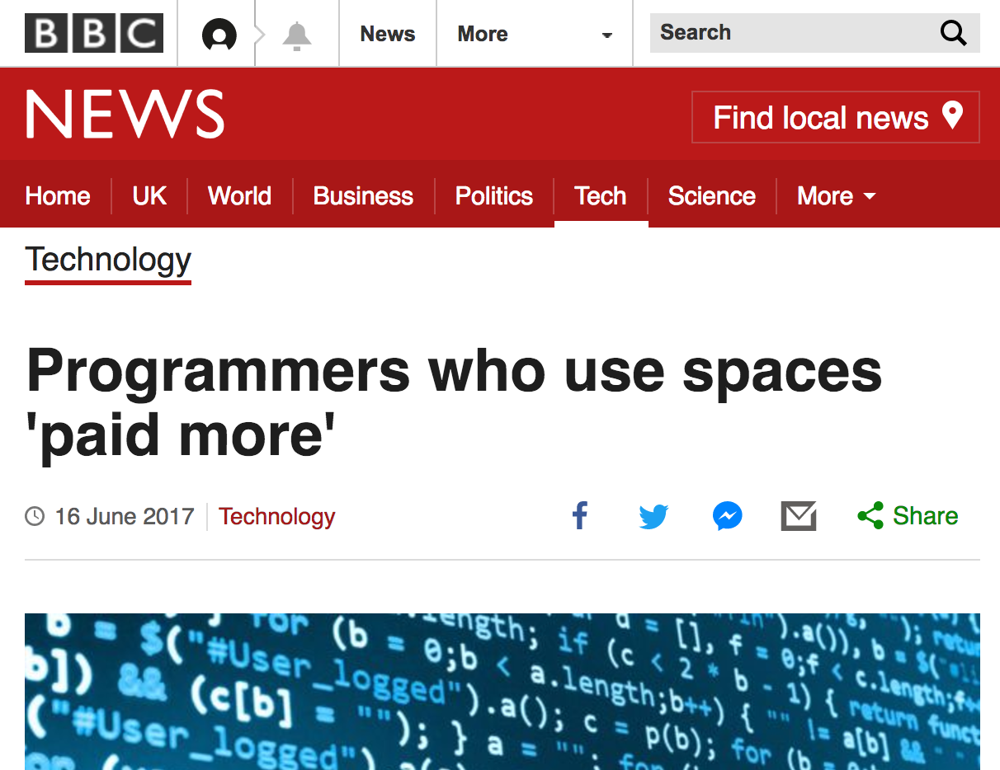
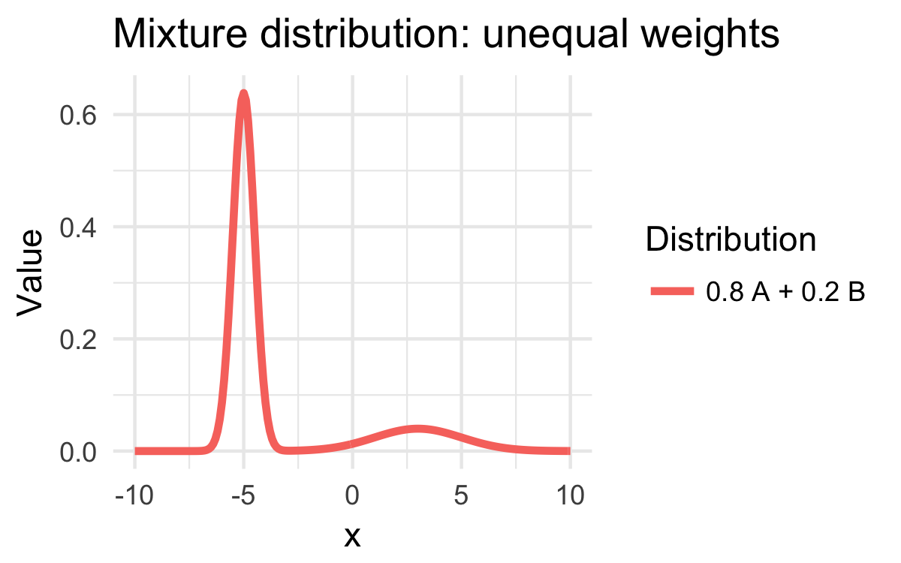
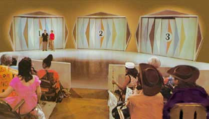
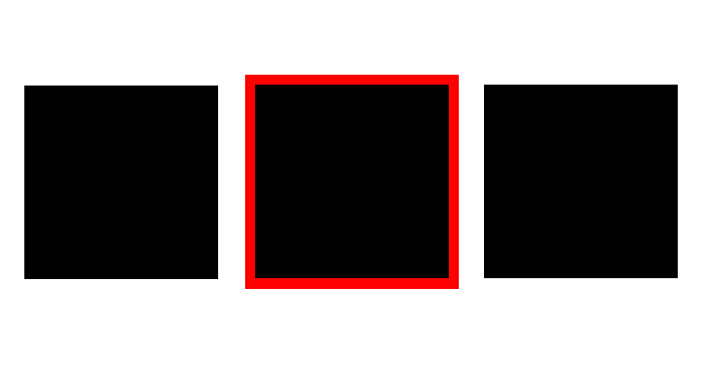
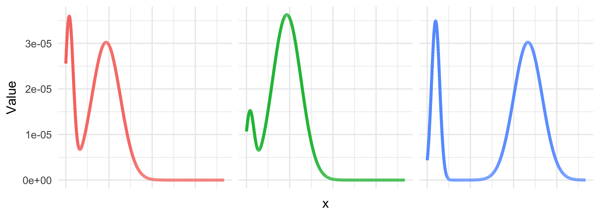
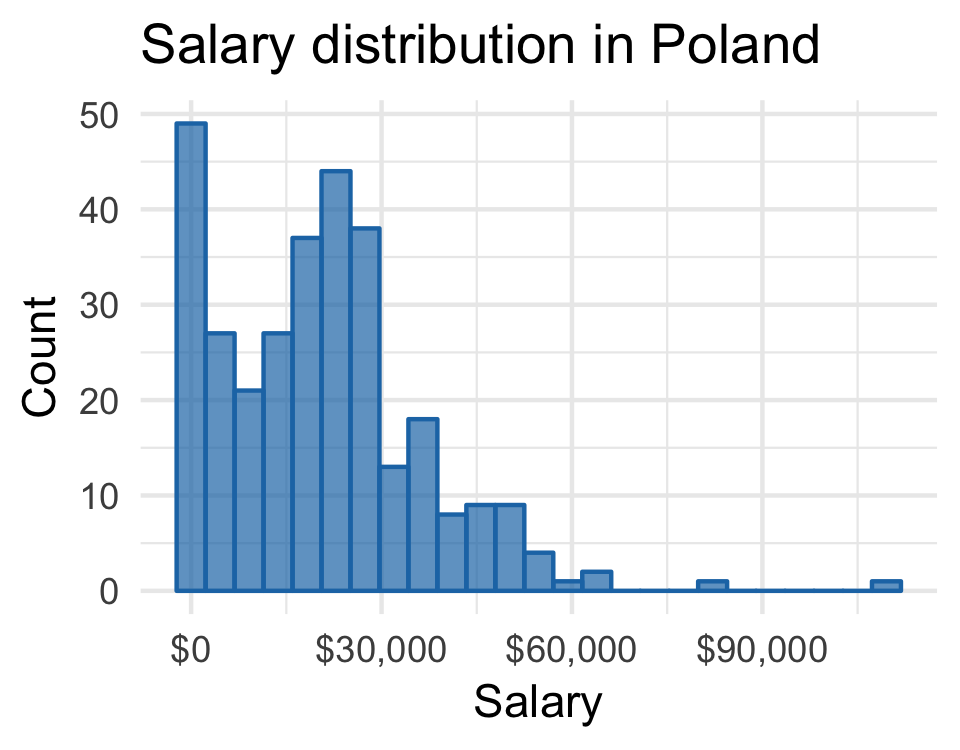
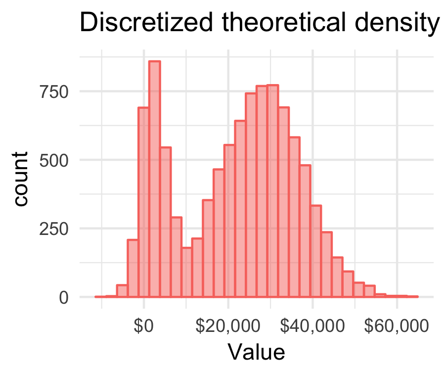

- title : Probabilistic Programming
- description : Probabilistic programming: how to look like a statistician
- author : Evelina Gabasova
- theme : white
- transition : none

***

- data-background: images/blackboard.png

 
## How to look like a statistician
### A developer's guide to probabilistic programming

 
### Evelina Gabašová
### @evelgab
 

------------------------------------------------------------------------------------------------

------------------------------------------------------------------------------------------------

------------------------------------------------------------------------------------------------

- data-background: images/science-dog.jpg

------------------------------------------------------------------------------------------------

------------------------------------------------------------------------------------------------

- data-background: images/blackboard.png

 
# Probabilistic programming
 

' what is probabilistic programming
' It's about writing probability distributions and their manipulations first-class citizens in 
' a programming language
' But why would you use that?

------------------------------------------------------------------------------------------------
- data-background: images/blackboard.png

 
# Probabilistic models
 

' what are they actually?

------------------------------------------------------------------------------------------------

- data-background: images/developer-survey-2017.png

------------------------------------------------------------------------------------------------

------------------------------------------------------------------------------------------------

------------------------------------------------------------------------------------------------

### Salary distribution

------------------------------------------------------------------------------------------------

------------------------------------------------------------------------------------------------

------------------------------------------------------------------------------------------------

------------------------------------------------------------------------------------------------

- data-background: images/blackboard.png

 
# What's wrong?
 

------------------------------------------------------------------------------------------------

> What is your current <u>annual</u> salary, in [local currency]? Please enter a whole number in the box below, without any punctuation. If you prefer not to answer, please leave the box empty/blank.

------------------------------------------------------------------------------------------------

------------------------------------------------------------------------------------------------

# Theory
## People reported their monthly salary

------------------------------------------------------------------------------------------------

- data-background: images/blackboard.png

 
## Mixture distributions
 

------------------------------------------------------------------------------------------------

------------------------------------------------------------------------------------------------

------------------------------------------------------------------------------------------------

------------------------------------------------------------------------------------------------

------------------------------------------------------------------------------------------------

- data-background : images/bored.gif

------------------------------------------------------------------------------------------------

- data-background: images/blackboard.png

 

# Probability distributions
## in probabilistic programming

 

' are an integral part of any probabilistic programming language and you can manipulate them

------------------------------------------------------------------------------------------------

' what does it mean?

## Mixture distribution: formally

$$$
\text{Salary} = p \; \mathcal{N}\left(\mu, \sigma^2\right) + \left(1-p\right) \; \frac{1}{12} \; \mathcal{N}\left(\mu, \sigma^2\right)

 

unknown: $ \mu$, $\sigma^2$, $p$

------------------------------------------------------------------------------------------------
- data-background: images/blackboard.png

<h1 style="font-size:1500%; color: white;"> ? </h1>

------------------------------------------------------------------------------------------------

- data-background: images/blackboard.png

 
# Sampling
 

' is a very efficient way of inferring 

------------------------------------------------------------------------------------------------

- data-background: images/blackboard.png

 
# Sampling: example
## Monty Hall problem
 

------------------------------------------------------------------------------------------------

# Monty Hall problem

------------------------------------------------------------------------------------------------

------------------------------------------------------------------------------------------------

------------------------------------------------------------------------------------------------

------------------------------------------------------------------------------------------------

------------------------------------------------------------------------------------------------

------------------------------------------------------------------------------------------------

------------------------------------------------------------------------------------------------

------------------------------------------------------------------------------------------------

- data-background: images/blackboard.png

 
## Demo
### Monte Carlo sampling
 

------------------------------------------------------------------------------------------------

- data-background: images/blackboard.png

 
## Demo
### Representing probability distributions
### with computation expressions
 

------------------------------------------------------------------------------------------------

## Mixture distribution: formally

$$$
\text{Salary} = p \; \mathcal{N}\left(\mu, \sigma^2\right) + \left(1-p\right) \; \frac{1}{12} \; \mathcal{N}\left(\mu, \sigma^2\right)

 

unknown: $ \mu$, $\sigma^2$, $p$

------------------------------------------------------------------------------------------------

## Mixture distribution: informally

$$$
\text{Salary} = p(\text{correct}) \,\times\, \text{Annual salary} + \\
 \;\;\;\;\;\;\;\;\; + \, p\left(\text{mistake}\right) \; \frac{1}{12} \,\times\, \text{Annual salary}

 

unknown: $ p(\text{correct})$, Annual salary

------------------------------------------------------------------------------------------------

- data-background: images/blackboard.png

 
# Inference 
## for mixture distributions
 

Easy if we knew the values of the unknown parameters
  

------------------------------------------------------------------------------------------------

## Mixture distributions
### Probabilistic programming

	let salary = Gaussian(mean,variance)
	let mistake = Bernoulli(probability)

	let observed =
	    if mistake then
	        1/12 * salary
	    else
	        salary

' much simpler
' This is an example of a potential probabilistic programming language
' Manipulating probability distributions directly

------------------------------------------------------------------------------------------------

- data-background: images/blackboard.png

 
## Demo
### Modelling probability distributions with computation expressions
 

------------------------------------------------------------------------------------------------

# Modelling 
## mixture distributions

But how do we get the parameters?

------------------------------------------------------------------------------------------------

------------------------------------------------------------------------------------------------

' You get PhD from Cambridge for this stuff
' This is exactly why people use probabilistic programming - because you don't have to know how 
' it works underneath

------------------------------------------------------------------------------------------------

## The world's slowest probability inference engine

------------------------------------------------------------------------------------------------

- data-background : images/mixture-of-gaussians-parameters.png
- class : withbackground

<h1> complete enumeration </h1>

------------------------------------------------------------------------------------------------

------------------------------------------------------------------------------------------------

### Try different parameter values

------------------------------------------------------------------------------------------------

### Discretize

------------------------------------------------------------------------------------------------

### Compare two discrete distributions

<table>
<tr> <td> 

</td>
<td>

</td></tr>
</table>

------------------------------------------------------------------------------------------------

- data-background: images/blackboard.png

 
## Demo
### The world's slowest probabilistic language
 

------------------------------------------------------------------------------------------------

------------------------------------------------------------------------------------------------

- data-background: images/blackboard.png

 
# Probabilistic programming
## in the real world
 

------------------------------------------------------------------------------------------------

- data-background : black

		data {
		  int<lower = 0> N;
		  vector[N] y;
		}

		parameters {
		  vector[2] mu;
		  real<lower=0> sigma[2];
		  real<lower=0, upper=1> theta;
		}

		model {
		  sigma ~ normal(0, 2);
		  mu ~ normal(0, 2);
		  theta ~ uniform(0.0,1.0);
		  for (n in 1:N)
		    target += log_mix(theta,
		      normal_lpdf(y[n] | mu[1], sigma[1]),
		      normal_lpdf(y[n] | mu[2], sigma[2]));
		}

------------------------------------------------------------------------------------------------

- data-background: images/stock-photo-mathematician.jpg
  
------------------------------------------------------------------------------------------------

- data-background : images/blackboard.png

<table>
<tr>
  <td class="noborder" style="width:60%;"></td>
   <td class="noborder" style="width:40%; background: white;">

<h1> Evelina Gabašová </h1>
<h3 >
@evelgab </h1>
<h3>evelinag.com</h1> 
      
</td> 
</tr>
</table>
